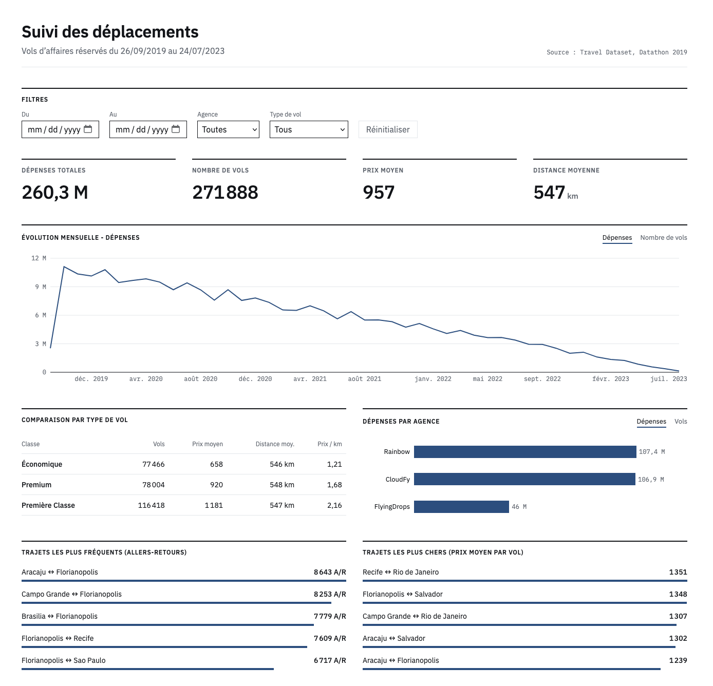
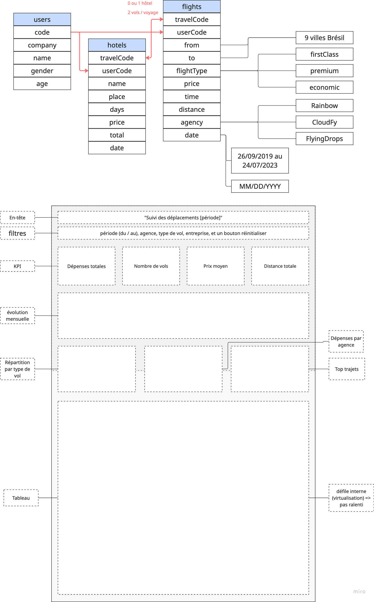

# Suivi des déplacements - dashboard des vols d'affaires

Dashboard destiné à une équipe de gestion des voyages d'entreprise, pour suivre les dépenses en vols et les tendances de réservation à partir du jeu de données *Travel Dataset - Datathon 2019* (table des vols, 271 888 lignes).



## Lancer le projet

Prérequis : Node.js 20 ou plus récent.

```bash
npm install
npm run dev       # http://localhost:5173
```

Version de production :

```bash
npm run build
npm run preview   # http://localhost:4173
```

Le fichier `flights.csv` (24,5 Mo) est inclus dans `public/data/`, aucune configuration n'est nécessaire.


## Fonctionnalités

| Demandé dans l'énoncé | Réalisation |
|---|---|
| KPI globaux | Dépenses totales, nombre de vols, prix moyen, distance moyenne |
| Classement des trajets les plus fréquents et/ou les plus chers | Les deux : top 5 en nombre d'allers-retours, top 5 en prix moyen par vol |
| Répartition par type de vol, comparant prix et distance | Tableau comparatif : vols, prix moyen, distance moyenne, prix au km |
| Volume et dépenses par agence | Graphique en barres avec bascule Dépenses / Vols |
| Tendance mensuelle du volume et des dépenses | Courbe avec bascule Dépenses / Nombre de vols |
| Filtres par période, agence et type de vol | Filtres globaux appliqués à tout le dashboard, avec bouton de réinitialisation |
| Tableau détaillé, triable et filtrable, à l'échelle | Tableau virtualisé, tri sur chaque colonne, suit les filtres globaux |

## Stack et raisons

| Outil | Pourquoi |
|---|---|
| React + TypeScript + Vite | Standard du marché, démarrage rapide. TypeScript sécurise la manipulation des données (types `Flight`, `Filters`...). |
| Web Worker + PapaParse | Le parsing de 24 Mo se fait hors du thread principal : l'interface reste réactive pendant le chargement. |
| TanStack Virtual | Seules les lignes visibles du tableau sont rendues (une trentaine au lieu de 271 888). |
| Recharts | API déclarative en composants React. Les graphiques ne reçoivent que des données agrégées (47 mois, 3 agences), jamais les 272k lignes. |
| CSS natif (Grid, variables) | Pas de framework CSS : mise en page en CSS Grid sur 12 colonnes, thème défini par des variables. |
| IBM Plex Sans / Mono (auto-hébergées) | Police conçue pour les outils professionnels. Livrée avec l'application : pas de requête vers un service externe. |

## Architecture

```
src/
├── data/
│   ├── flights.worker.ts    # téléchargement, parsing et nettoyage du CSV (Web Worker)
│   └── loadFlights.ts       # expose le worker sous forme de Promise
├── logic/
│   ├── filters.ts           # filtrage (fonctions pures)
│   └── aggregations.ts      # KPI, séries mensuelles, regroupements (fonctions pures)
├── components/              # FiltersBar, KpiCard, MonthlyTrend, FlightTypeTable,
│                            # AgencyBreakdown, TopRoutes, FlightsTable, Toggle
├── types.ts                 # types Flight, Filters
├── labels.ts                # libellés français des types de vol
├── format.ts                # formats de nombres et de dates (fr-BE)
├── theme.ts                 # couleurs des graphiques
└── App.tsx                  # état (données, filtres) et assemblage
```

Flux des données :

```
flights.csv → Web Worker (parsing + nettoyage) → flights
flights + filtres → filteredFlights → KPI, séries, classements, tableau
```

- **La logique est séparée de l'affichage.** Les calculs vivent dans `logic/` sous forme de fonctions pures, sans dépendance à React : elles sont faciles à tester et à réutiliser.
- **Les données sont nettoyées une seule fois**, au chargement : conversion des dates `MM/DD/YYYY`, précalcul du jour (`2019-09-26`) et du mois (`2019-09`).
- **L'état des filtres vit dans `App`**, car tous les blocs en dépendent. L'état propre à un bloc (indicateur affiché, colonne triée) reste dans le composant concerné.
- **Chaque calcul dérivé est mémorisé avec `useMemo`.** Changer un filtre recalcule la chaîne une fois ; basculer un indicateur ou faire défiler le tableau ne recalcule rien.

## Performance

Mesures faites avec `performance.now()` (visibles dans la console) :

| Opération | Durée |
|---|---|
| Téléchargement + parsing + nettoyage de 271 888 lignes | environ 2 à 3 s, hors du thread principal |
| Filtrage | 6 à 25 ms |
| Tri du tableau complet | 110 à 240 ms (27 ms sur une sélection de 38 758 vols) |
| Lignes du tableau présentes dans le DOM | environ 30 |


Point notable : l'option `worker: true` de PapaParse fonctionnait en développement mais échouait une fois le code minifié par `npm run build`. J'ai donc écrit mon propre Web Worker, que Vite empaquette correctement en développement comme en production.

## Choix UX



- **Hiérarchie** : filtres, puis KPI, puis tendance, puis répartitions, puis détail. Le plus important est visible sans défiler.
- **Des filtres globaux** : un seul jeu de filtres pour tout le dashboard, pour que tous les chiffres affichés portent toujours sur la même sélection.
- **Une bascule plutôt qu'un double axe** pour la tendance mensuelle et les agences : deux échelles sur un même graphique suggèrent des corrélations trompeuses.
- **Un tableau pour la comparaison par type de vol** : prix et distance ont des unités différentes et ne peuvent pas partager un axe. Les colonnes distance moyenne et prix au km montrent qu'à distance égale, la première classe coûte presque deux fois plus cher au kilomètre.
- **Une seule couleur de données** : chaque graphique montre une seule mesure, plusieurs couleurs feraient croire à des catégories différentes.
- **Des états explicites** : chargement, erreur, et sélection vide (par exemple FlyingDrops + Économique, cette agence ne vendant que de la première classe).
- **Responsive** : la grille passe sur une colonne sous 900 px, le tableau défile horizontalement.
- **Accessibilité** : éléments HTML natifs (boutons, labels, `<table>` pour la comparaison), navigation au clavier avec focus visible, rôles ARIA et `aria-rowcount` / `aria-rowindex` sur le tableau virtualisé, `aria-sort` sur les en-têtes, `aria-pressed` sur les bascules. Les valeurs sont écrites à côté des barres : l'information ne passe jamais par la couleur seule.
- **Thème en variables CSS** : le thème tient en une dizaine de variables dans `index.css`, facile à adapter à la charte d'un client.

## Hypothèses et interprétations

- **Trajets regroupés dans les deux sens** (A - B) : chaque voyage est un aller-retour (vérifié : chaque `travelCode` correspond exactement à un vol A à B et à un vol B à A). Pour une équipe de gestion des voyages, Recife à Natal et Natal à Recife relèvent de la même relation.
- **Allers-retours et filtre de dates** : un aller-retour est compté dans une période dès qu'au moins un de ses deux vols y figure. Un voyage à cheval sur deux périodes apparaît donc dans les deux.
- **Prix moyen** : calculé par vol, pas par voyage.
- **Devise** : non précisée dans le jeu de données, aucun symbole n'est affiché.
- **Observations sur les données** : septembre 2019 ne contient que 5 jours ; le volume baisse de façon continue jusqu'en 2023. Ce sont des caractéristiques du jeu de données.
- **Périmètre** : l'énoncé porte sur la table des vols uniquement. Les fichiers `users.csv` et `hotels.csv` du jeu de données complet ne sont pas utilisés.

## Limites et pistes d'amélioration

Par ordre de priorité :

1. **Tests unitaires** des fonctions de `logic/` (filtres, agrégations, comptage des allers-retours).
2. **Tri dans le Web Worker**, pour supprimer la latence de 110 à 240 ms sur le tableau complet.
3. **Error Boundary** autour des graphiques, pour qu'une erreur dans un bloc n'affecte pas le reste de la page.
4. **Recherche par ville** dans le tableau.
5. **Filtres dans l'URL**, pour partager une vue filtrée.
6. **Export CSV** de la sélection.
7. **Filtre par entreprise cliente** (jointure avec `users.csv`) et **coût total des voyages** vols + hôtel (jointure avec `hotels.csv`).
8. **Couleurs des graphiques** : Recharts utilise des attributs SVG, les couleurs sont donc dupliquées dans `theme.ts` au lieu de lire les variables CSS.

## Utilisation de l'IA

J'ai utilisé Claude comme assistant pendant le développement :

- **Comprendre les librairies** : prise en main de TanStack Virtual, Recharts et PapaParse.
- **Écrire du code** : une partie du code a été générée avec Claude, puis relue et adaptée au projet.

Les choix d'architecture, d'interface et d'interprétation des données décrits dans ce README sont les miens.